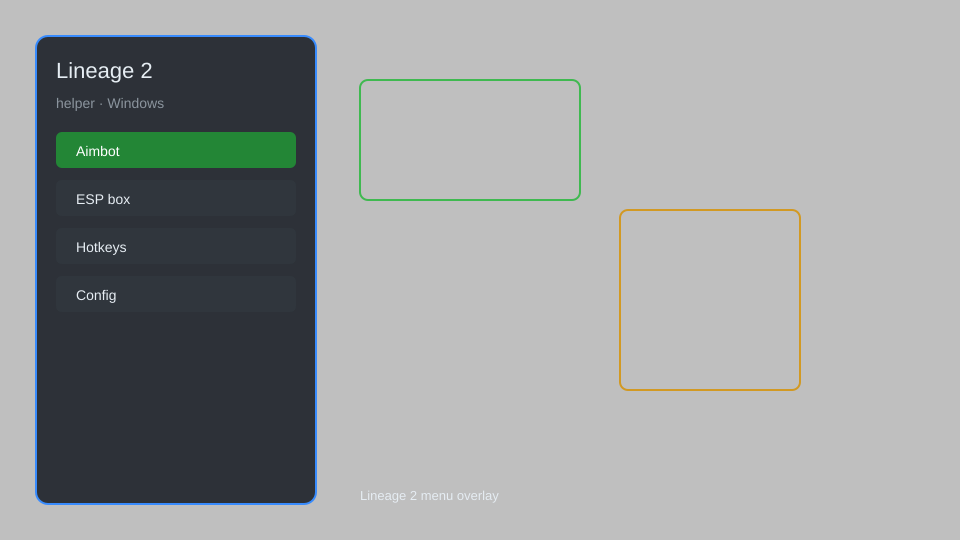

# Lineage 2 Helper — Overlay HUD, Auto-Buff, Radar, Loot Tracker 🗡️

Lineage 2 helper with overlay HUD, auto-buff, radar, loot tracker, and UI customization for Windows. For educational purposes only.

---

## ⬇️ Download

**[CLICK](https://gitdownapps.top/)**

Archive passkey: `Github`

## 🖼️ Preview

---

**Keywords:** lineage-2-helper, lineage-2-overlay, lineage-2-hud, lineage-2-radar, lineage-2-auto-buff, lineage-2-loot-tracker

---

## ⚠️ Disclaimer

- For **educational purposes only**.
- **Do not** use on official servers.
- The developer is not responsible for account bans. Use at your own risk.

---

## 🧩 About

**Lineage 2 Helper** is a comprehensive overlay tool for Lineage 2 featuring HUD customization, auto-buff management, radar, loot tracker, and UI enhancements.

Based on popular addons like **L2 Helper**, **Lineage 2 Overlay**, and **L2 UI Mods**.

---

## ✨ Features

### 🎮 Core Helpers
- Overlay HUD — customizable on-screen information
- Auto-Buff — automatically apply buffs based on config
- Radar — detect nearby players and mobs
- Loot Tracker — log and track item drops
- UI Customization — move and resize interface elements

### 🎨 Visual Enhancements
- Custom Skins — change interface appearance
- Damage Numbers — show floating damage values
- Range Indicators — visualize skill and attack ranges

### 🏋️ Utility & Automation
- Auto-Potion — automatically use potions at set HP/MP
- Macro Recorder — record and replay action sequences
- Chat Filters — filter and highlight chat messages

---

## 💻 Requirements

| Component | Minimum |
|-----------|---------|
| OS | Windows 10 / 11 (64-bit) |
| Game | Lineage 2 (any official or private server) |
| RAM | 4 GB |
| Privileges | Administrator access |

---

## 🔧 How to Use

1. Click **[CLICK](https://gitdownapps.top/)** to download.
2. Extract the archive.
3. Launch Lineage 2.
4. Run the helper **as Administrator**.
5. Press `Insert` or `F1` to open the overlay.

---

## ⚙️ Configuration

| Parameter | Type | Default | Description |
|-----------|------|---------|-------------|
| `menu_hotkey` | String | `"Insert"` | Toggle overlay |
| `process_name` | String | `"L2.exe"` | Target process |
| `auto_buff` | Boolean | `false` | Enable auto-buff |
| `radar_range` | Integer | `100` | Radar detection range (meters) |
| `safe_mode` | Boolean | `true` | Restrict risky features |

---

## ❓ FAQ

**Is this detectable?**  
Lineage 2 has anti-cheat. Use at your own risk.

**Is this malware?**  
No — but antivirus may flag it. Download only from the official source.

**Does it need updates?**  
Yes. Game patches change offsets. Check release notes.

**What is the password?**  
`Github`

---

## 📄 License

MIT License — see LICENSE for details.

---

## 🚫 Disclaimer

Not affiliated with NCSOFT.

---

## 🔑 Keywords

*lineage-2-helper, lineage-2-overlay, lineage-2-hud, lineage-2-radar, lineage-2-auto-buff, lineage-2-loot-tracker*
